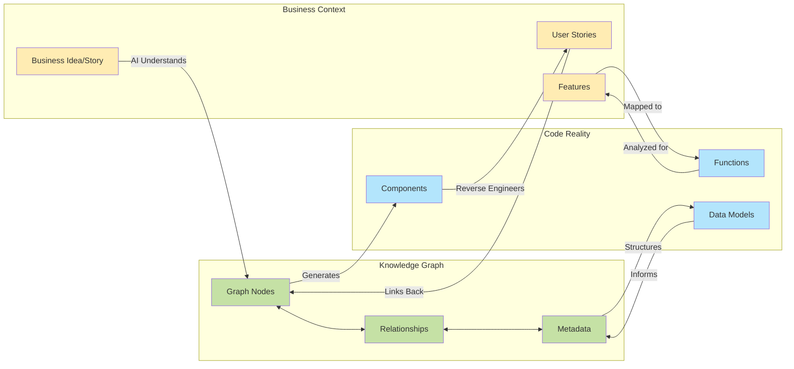
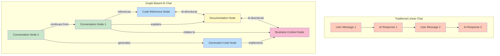
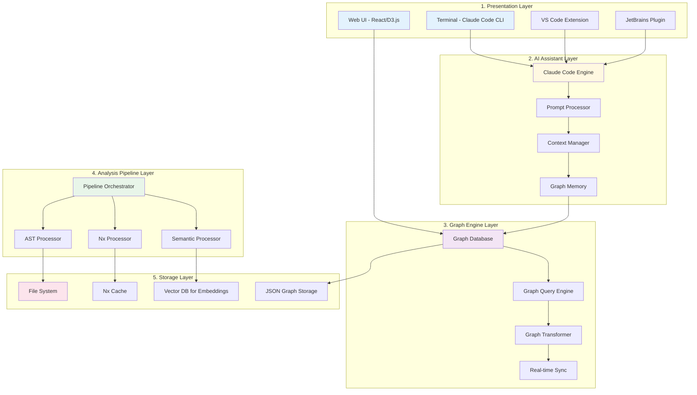
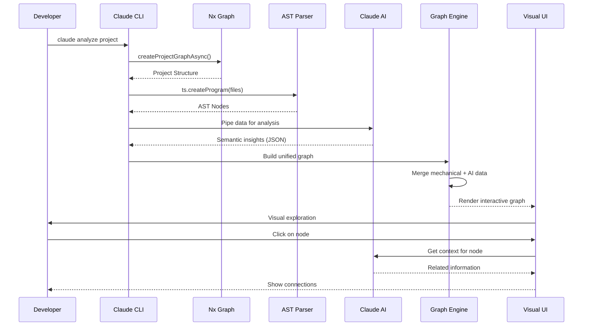

# Grafity Architecture Vision: Graph-Based AI Development Platform

## High-Level Vision Diagram

```mermaid
graph TB
    subgraph "User Experience Layer"
        UI[Visual Graph Interface]
        CLI[Claude Code CLI]
        IDE[IDE Plugins]
    end

    subgraph "AI Intelligence Layer"
        CC[Claude Code AI Assistant]
        GP[Graph Pattern Recognition]
        CG[Code Generation Engine]
        SC[Semantic Comprehension]
    end

    subgraph "Graph Processing Layer"
        GE[Graph Engine]
        BG[Business Graph Builder]
        CGB[Code Graph Builder]
        DG[Document Graph Builder]
        GC[Graph Connector/Linker]
    end

    subgraph "Mechanical Analysis Layer"
        NX[Nx Project Graph]
        AST[TypeScript AST Parser]
        DF[Data Flow Analyzer]
        RE[Reverse Engineering]
    end

    subgraph "Data Sources"
        CODE[Source Code]
        DOCS[Documentation]
        CONF[Confluence/Wiki]
        CONV[AI Conversations]
    end

    %% User Interactions
    UI -->|Visual Manipulation| GE
    CLI -->|Commands/Queries| CC
    IDE -->|Code Changes| AST

    %% AI Processing
    CC -->|Semantic Analysis| SC
    CC -->|Pattern Detection| GP
    CC -->|Code Synthesis| CG

    %% Graph Building
    GE -->|Orchestrates| BG
    GE -->|Orchestrates| CGB
    GE -->|Orchestrates| DG
    GE -->|Links| GC

    %% Mechanical Analysis
    NX -->|Project Structure| CGB
    AST -->|Code Details| CGB
    DF -->|Relationships| CGB
    RE -->|Business Context| BG

    %% Data Flow
    CODE -->|Parsed by| AST
    CODE -->|Analyzed by| NX
    DOCS -->|Extracted to| DG
    CONF -->|Imported to| DG
    CONV -->|Nodes in| GC

    %% Bidirectional Connections
    BG <-->|Bi-directional Links| CGB
    CGB <-->|Bi-directional Links| DG
    DG <-->|Bi-directional Links| BG

    style UI fill:#e1f5fe
    style CLI fill:#e1f5fe
    style IDE fill:#e1f5fe
    style CC fill:#fff3e0
    style GP fill:#fff3e0
    style CG fill:#fff3e0
    style SC fill:#fff3e0
    style GE fill:#f3e5f5
    style BG fill:#f3e5f5
    style CGB fill:#f3e5f5
    style DG fill:#f3e5f5
    style NX fill:#e8f5e9
    style AST fill:#e8f5e9
    style DF fill:#e8f5e9
    style RE fill:#e8f5e9
```



## Conceptual Flow: From Ideas to Implementation



## Core Innovation: Graph-Based AI Conversations



## Technical Architecture Layers



## Data Flow: Mechanical + AI Integration



## Key Capabilities We're Building

### 1. **Bi-Directional Graph Connections**
- Code ↔ Business Context
- Documentation ↔ Implementation
- Ideas ↔ Features
- Conversations ↔ Knowledge

### 2. **Mechanical Accuracy**
- Nx for project structure (50x faster)
- TypeScript AST for code details
- Data flow analysis for relationships
- 100% accurate structural data

### 3. **AI Enhancement**
- Claude Code for semantic understanding
- Pattern recognition across codebase
- Business context extraction
- Natural language to code generation

### 4. **Visual Intelligence**
- Interactive graph navigation
- Multi-level views (System/Business/Component/Code)
- Real-time updates as code changes
- Spatial conversation history

### 5. **Developer Experience**
- CLI for automation: `nx graph | claude -p "analyze"`
- IDE integration for inline assistance
- Web UI for visual exploration
- API for custom tooling

## End Goal: The Knowledge-Code Continuum

```
Ideas → Conversations → Graphs → Code → Analysis → Understanding → Ideas
         ↑                                                            ↓
         └──────────────── Continuous Feedback Loop ─────────────────┘
```

Every piece of knowledge, conversation, and code becomes interconnected nodes in a living graph that grows and evolves with your project.